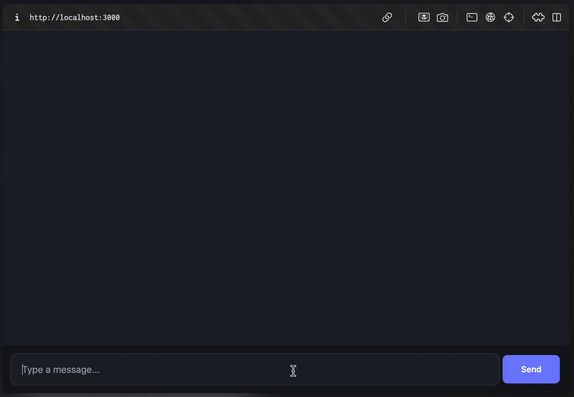
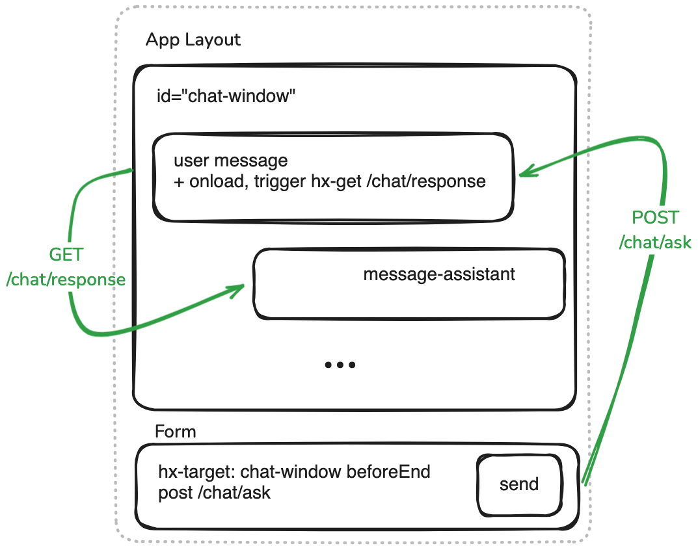

<!-- markdownlint-disable MD001 MD033 -->
# Grug Guide: Use HTMX OpenAI Assistant Chat  

Grug build simple chat tool. Tool good for talk to AI assistant without extra fluff. Grug explain how to make it work.



## What Grug Tool Do  

- Grug tool use HTMX for talk between browser and server.  
- Memory stay in Grug tool brain (server) by IP address. This keep chat bubbles in place.  
- No big state machine. Just hypermedia—simple and clean, like good rock.  
- Built with Express and Handlebars. Grug like these—they work.  

## How Grug Run Tool  

1. Grug need **OPENAI_API_KEY** and **ASSISTANT_ID**. No key, no work.

> [!TIP]
> If Grug not Find Key, check  [Open AI Cave](https://platform.openai.com/playground/assistants)

2. Grug clone tool code to cave:  

   ```bash  
   git clone https://github.com/rogersnick/htmx_openai_assistant_chat.git  
   ```

3. Grug go to code folder:  

   ```bash  
   cd htmx_openai_assistant_chat  
   ```

4. Grug install tool dependencies:  

   ```bash  
   npm install  
   ```

5. Grug set API key and assistant ID in `.env.developer` file:  

   ```env  
   OPENAI_API_KEY=your-key-here  
   ASSISTANT_ID=your-assistant-id-here  
   ```  

6. Grug start server with dev mode for reloads:  

   ```bash  
   npm run dev  
   ```

7. Grug open browser and go to `http://localhost:3000`. Grug see chat, Grug happy.  

## How Tool Work Inside  

- Grug keep things simple. Form send messages with HTMX.  
- Server use Express for routes.  
- Handlebars make chat bubbles look nice.  
- No extra. Just rocks (HTML), fire (JS), and wheel (CSS).  




Grug think tool good for demos or testing. If tool break, Grug say sorry but you fix.  

Enjoy tool. Grug hope it help!

## How Tool Handle Function Calling

Tool work inside class called `AIProvider`. Method called `getToolOutputs` make magic happen. Grug give example tool called get_current_date.

If Grug want assistant use this tool, Grug add special thing in OpenAI console. Here how:

```json
{
  "name": "get_current_date",
  "description": "This method will return the current date in standard ISO format YYYY-MM-DD",
  "strict": false,
  "parameters": {
    "type": "object",
    "properties": {
      "dummy_property": {
        "type": "null"
      }
    },
    "required": []
  }
}
```
Grug’s secret: this tells assistant, "Hey, go get date and show it in simple format." Simple. Grug likes it.

# Want Help?

Grug love pull requests. Grug read them all. Here things Grug want help with:

- Make easy way to input custom ASSISTANT_ID and OPENAI_API_KEY (no more env variables, Grug lazy).
- Add streaming responses, make it flow smooth.
- Handle media too—images, Grug like images.

Send Grug pull request, Grug look at it!